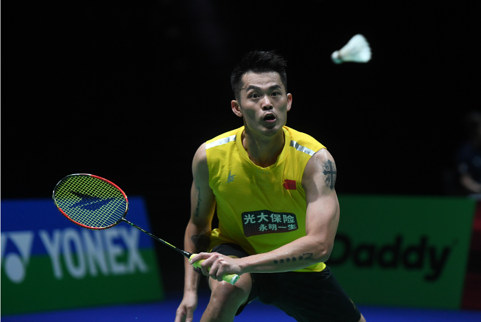
### 羽毛球历史

羽毛球起源于印度，形成于英国。通常由两名对手或两组对手之间进行。
比赛的目标是在对方场地上地面上回合过网的方式，使羽毛球着地，从而得分。

### 羽毛球制作
比赛中使用的羽毛球应由16根羽毛固定在球拖上，由鹅毛制成的，但现代比赛中更常用的是由合成材料制成的羽毛球。羽毛球拍通常由轻质材料制成，如碳纤维或铝合金，以确保拍的轻便性能。

### 羽毛球拍四大基本属性

#### 一、球拍重量（weight）
U为重量单位(以下均指未穿线时球拍重量)
* 3U 85-89.9g
* 4U 80-84.9g
* 5U 75-79.9g
* 6U 70-74.9g

一般来说球拍重量越重，进攻性越好，不过打起来会累一些。

#### 二、拉线磅数（tension）
初学者建议20-24磅之间;
有一定基础的爱好者建议24-28磅之间，业余高手建议选择28磅以上;
磅数越高，球拍线越硬，弹性差，但是击球落点精准;

#### 三、平衡点（balance）
平衡点是指底盖到支点的距离，数值越大代表拍头越重，数值越小代表拍头越轻。
295mm以上代表头重，290mm以下代表头轻。

#### 四、中杆硬度（stiffness）
中杆硬度影响打球的手感，中杆软的球拍容易控制，好打,比较适合初学者;
中杆硬度硬的球拍力的传导好，击球精准，比较适合进攻。

### 羽毛球的规则
#### 一、比赛计分：
羽毛球比赛规则从2006年5月开始，正式决定实行二十一分的比赛规则。

1、每场比赛采取三局两胜制。

2、比赛开始前，双方选手通过投掷硬币方式确定由哪一方来选择是先发球或后发球。

3、率先得到21分的一方赢得当局比赛。

4、如果双方比分打成20比20，获胜一方需超过对手2分才算取胜。

5、如果双方比分打成29比29，则率先得到第30分的一方取胜。首局获胜一方在接下来的一局比赛中先发球。
#### 二、发球规则：
发球图解

##### 单打发球区
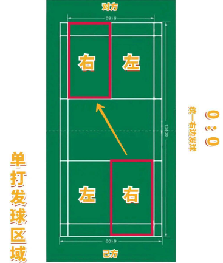  

##### 单打比赛区

### 羽毛球基本技术动作

1、杀球

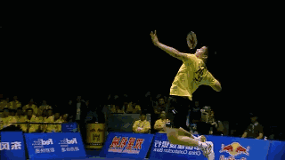

杀球是把对方打过来的高球，尽量在高的击球点上用力扣压下去。
这种球力量大、速度快，主要包括正手杀球、反手杀球和头顶杀球3种技术。

2、接杀球

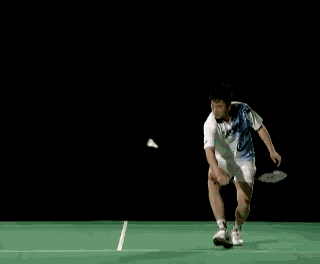

转守为攻的打法，分为挡网前球，抽后场球和挑高球。

3、反手放网前球 （网前必备技术之一）

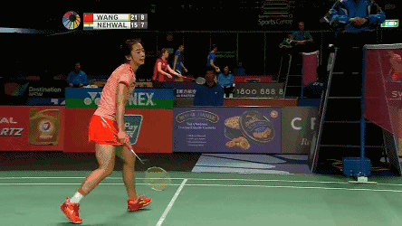

是将对方的吊球或网前球，用球拍轻轻一托，使球一过网顶就朝下坠落。

4、高远球（业余选手最基础技术）

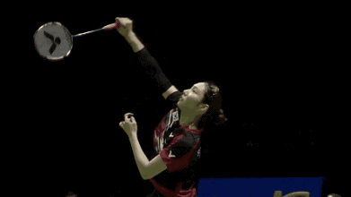

用较高的弧线把球击到对方底线附近，以削弱对方的进攻威力，消耗对方的体力。

5、吊球（迷惑对手的技术）

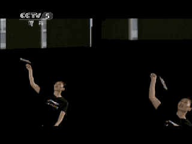

把对方击来的球，从后场轻巧地还击到对方网前地区，叫吊球。
它是调动对方，打乱对方阵脚、配合战术的一种击球技术。

6、扑球（网前进攻技术）

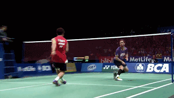

是常用的一项进攻技术。
当对方发网前球或回击网前球，球越过网顶时，弧度较高，即迅速上步在网前举拍扑杀。

7、挑高球（防守调整技术）

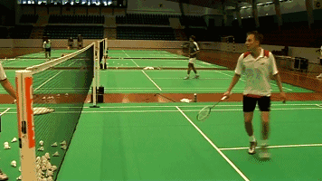

是把对方击来的吊球或网前球挑高，回击到对方后场去。
这是在比较被动的情况下，采取的一项防守性技术。

8、搓球（展示手感的技术）

是放网前球技术的一种发展。
击球点大约与肩同高时，利用"搓"、"切"、"挑"的动作，摩擦球托底部，使球改变在空中的正常运行轨道，产生沿横轴翻滚或纵轴旋转越过网顶。

9、推球（快速平压底线技术）

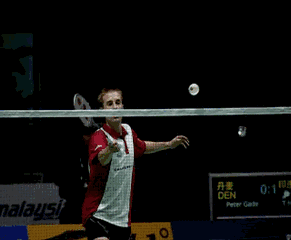

是与网前假动作相配合，在引诱对手上网时，突然将球快速推到后场底角。

10、勾球（出其不意的技术）

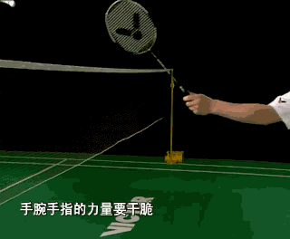

是在网前回击对角线的球。它和搓球、推球结合起来运用，常能达到声东击西的效果。

11、抽球

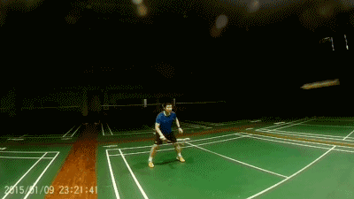

是击球平飞过网的一种打法。抽击时，击球点在肩部以下的两侧，是下手击球速度较快的一项进攻技术。