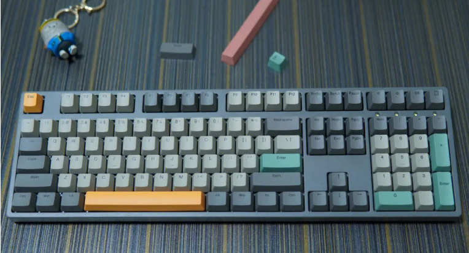
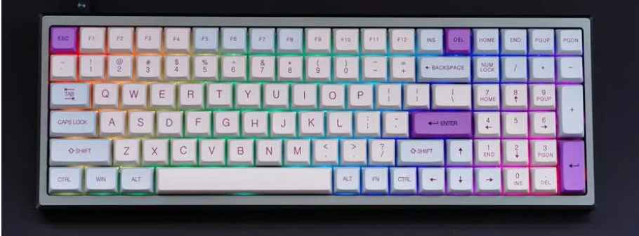
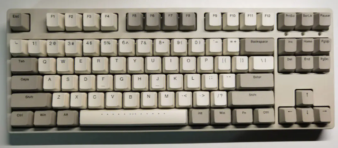
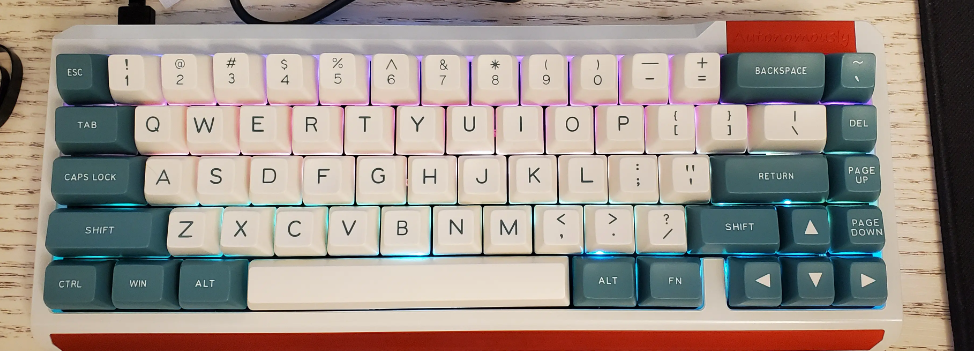

# 键盘

## 什么是键盘？

键盘是一种计算机外设设备，用于输入文字、数字和符号到电脑或其他电子设备上。
键盘通常由一系列按键组成，每个按键上标有一个特定的字符，如字母、数字、标点符号等。
通过按下不同的按键，用户可以向计算机发送相应字符的指令，以完成各种操作。
键盘是计算机中最常用的输入设备之一，被广泛用于个人电脑、笔记本电脑、平板电脑和智能手机等设备上。

## 机械键盘和普通键盘？
机械键盘和普通键盘主要有以下几个区别:

* 按键机制：机械键盘使用机械开关作为按键机制,这种开关有明确的触感反馈和按压点。而普通键盘通常使用橡胶冲泡或薄膜开关,按压感觉比较软。

* 使用寿命：优质的机械键盘按键的寿命通常能达到5000万到1亿次,远超过普通键盘。这样使用寿命比较长。

* 按键手感：机械键盘的按键更有handfeel,给人明确点击的感觉反馈。而普通键盘按键手感比较模糊。

* 键盘声音：机械键盘按键拥有较大的游程,按下去会有明显的声音。而普通键盘的声音很小。

* 价格：机械键盘通常价格较高,从几百元到上千元不等。而普通键盘的价格便宜很多。

总的来说,机械键盘主要优点是手感好、按键寿命长,比较适合追求打字手感的人或者玩游戏对手感要求高的人群。而普通键盘价格便宜普及率更高。

## 机械键盘

### 机械键盘键数区分
#### 一、100%尺寸（104或108键）

传统配列布局，是最为标准的布局方式。键盘功能齐全，带有数字小键盘，能够兼顾游戏和办公的特性。
>108键位比104键位多了右上角的媒体按键，比如控制音乐播放等

#### 二、85%尺寸（96键或者92键）

此种键盘配列主要是去掉了控制区域，也就是方向键盘区域，方向键位使用其他键位代替，主要是为了兼顾功能和占用空间。

#### 三、80%尺寸（87键，这种是去掉了小键盘区）

87键位的键盘也是最常用的机械键盘。是在104键位的基础上，砍掉了数字键盘区域的键位。
主要是为了减少机械键盘占用的空间。其他键位和104键位是保持一致的。

#### 四、75%尺寸（82键或者76键，这种是将几个光标键整合进了主键区）
此种键盘在104键键盘的基础上去掉了数字键盘，并把方向键盘区域整合进了主键区，去掉了一部分功能按键，和96键与92键类似，属于键位整合，适应不同的需求。

#### 五、60%尺寸（61键，就剩下主键盘了）

这种类型的机械键盘，见到以及用的都比较少。只保留了主键盘区域，方向键和数字键盘区等都去掉了。
### 机械键盘不同轴

#### 红轴（操作压力44.1g±14.7g）
线性轴,线性轻手感，最为平衡的键轴。无按键感觉,手指压力最小,通常用于游戏。

#### 黑轴（操作压力58.9g±14.7g）
线性轴,按压力度与红轴相同,但是按下去没有声音及感觉反馈。
黑轴是适合游戏的，但是不一定每个人都适合黑轴，需要根据自身情况具体分析。

#### 茶轴（操作压力44.1g±14.7g）
线性轴,按压轻,但有明显的按键感觉,同时发出点击声音。
相比青轴，茶轴的段落感要弱很多，而对比黑轴，又不是直上直下的感觉，2mm即可触发，属于比较奢侈的机械轴。

#### 青轴（操作压力58.9g±14.7g）
段落轴，段落感最强、青轴的噪声最大，机械感最强，
是机械键盘的代表轴，需下压2.4mm才可触发，打字节奏感十足，但是声音较大，比较吵,压力克数为60g。

#### 总结
不同厂商也会有自己的轴体系,如Razer 的黄轴/粉轴,Steelseries的紫轴等。
选择需要根据个人的使用需求来决定。