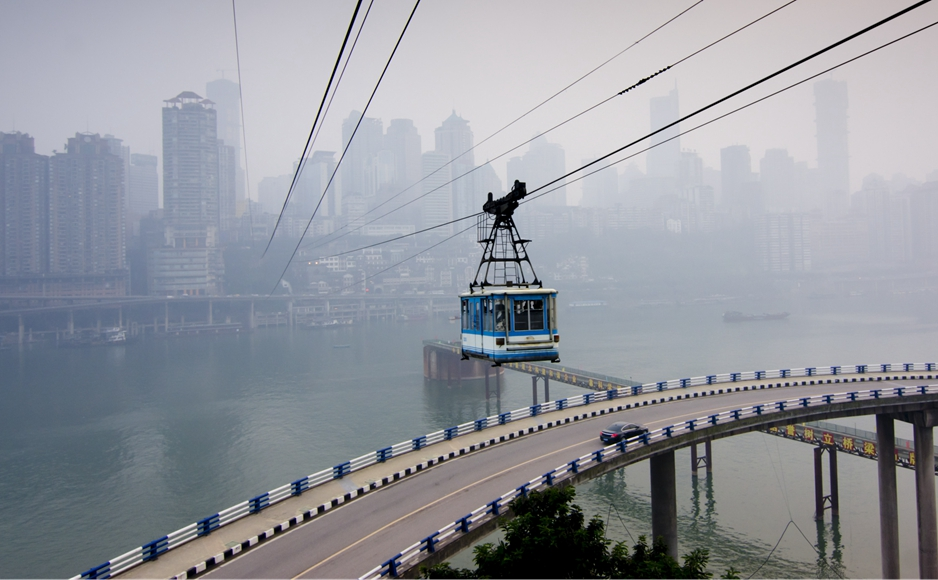

# 加州花园 F4 "交流会" 

## Info

| Date       | Address      | Mood |
|------------|--------------|-----|
| 2023-11-7  | 重庆-加州花园  ️ | 🌕  |

## One sentence

> 智慧是知道下一步做什么，技能是知道如何做，而美德就是去做。
> 
> *Wisdom is knowing what to do next, skill is knowing how to do it, and virtue is doing it.*

## Member

> 豪哥、北北、维维、我

## Content
  
 此次会议，明确主题

   
 在认识朋友的同时,也是不断的认识自我

    
  北北说我‘人好’。
   豪哥说的我谦虚、谦逊。
   维维眼中的我，是一个细节、脾气好、温柔、有大爱、为他人考虑，还有真诚（我理解的（不怀好意）--不就是心大嘛，哈哈哈哈）。 
   不足：不够外向，再open一点就更好了
   忘太多了，害。

   这次，让我真正的学到了一点是“能量”，每个人对于其他人都有能量的高低之分。 之前也听说过“能量”这个，但并没有真正的理解它。 维维说的这个能量其实就是 阅历、经历、能力 总和。
   在我现在理解看来，也确实是。如果A对B来说，A的能量要远远高于B，那A和B的交流、或者相处那A应该是向下兼容B的、能够给B带来情绪价值？ 或者是会教会B一些东西？随笔写的，非正确
   

   
   