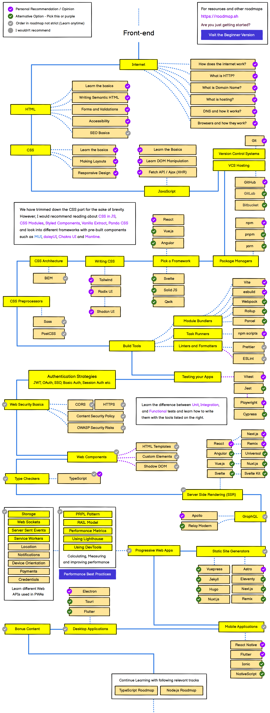

### 什么是前端开发？
前端开发是开发网站的视觉和交互元素，用户可以直接与之交互。它是HTML、CSS和JavaScript的组合，其中HTML提供结构，CSS提供样式和布局，而JavaScript提供动态行为和交互性。

### 前端开发人员是做什么的？
作为一名前端开发人员，您将负责创建网站的用户界面，以确保它看起来很好，易于使用，并非常注重设计原则和用户体验。您将与设计师，后端开发人员和项目经理密切合作，以确保最终产品满足客户的需求，并为最终用户提供最佳体验。

### 前端开发人员路线图

参考文档
Developer Roadmaps：https://roadmap.sh/roadmaps