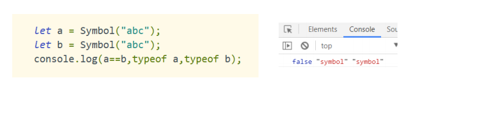
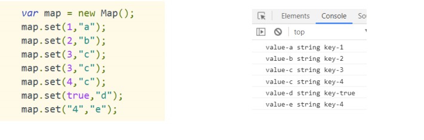
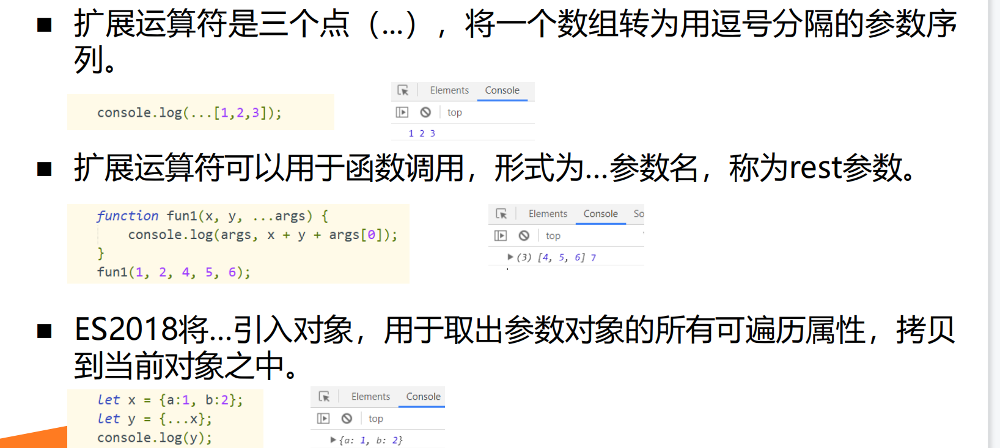
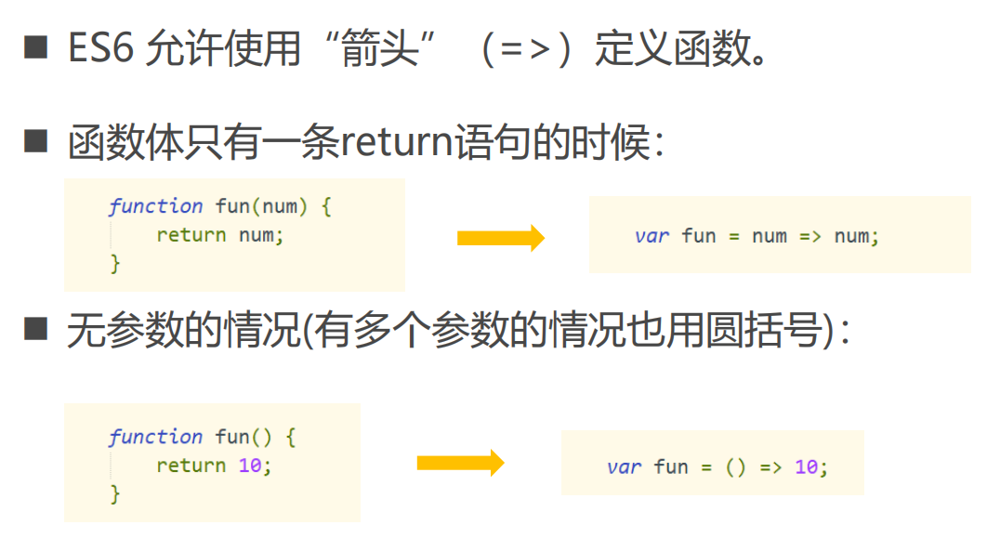
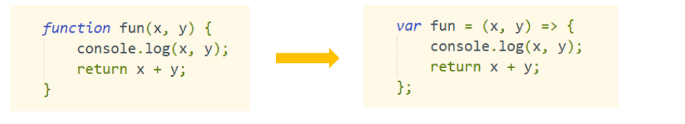

> ECMAScript 6.0（以下简称ES6）是JavaScript语言的下一代标准，已经在2015年6月正式发布了。

### let

1.声明变量，类似var，但只能在let所在的代码块内有效。

2.没有变量提升，必须在变量使用之前定义，否则报错。

3.同一个作用域内，不允许重复定义变量。

### const

const   声明常量 ，和let相同，只在声明的块级作用域中有效。 用let、const定义的变量、常量不属于全局对象


### 新增加的原始数据类型Symbol

表示独一无二的值




### 变量的解构赋值

解耦：ES6 允许按照一定模式，从数组和对象中提取值，对变量进行赋值。

注意：如果解构不成功，变量的值就等于undefined。

###### 数组解构赋值

###### 字符串解构赋值

###### 对象解构赋值

对象解构赋值，解构的是名称而不是数字。变量必须和属性同名才能取到正确的值。

###### 函数参数解构赋值

###### 解构赋值中number和boolean的自动转型


#### 解构赋值的应用

###### 1.交换两个变量的值

```javascript
let x ;
let y ;
[x,y] = [y,x] ;
```

###### 2.从函数返回多个值

```javascript
function fun(){
    return [1,2,3];
}
let [a,b,c] = fun();
```

###### 3.快速提取JSON对象的数据

```javascript
let jsondata = {
    id : "8",
    name : "张飞",
    data : ["123","566"]
};
let {id,name,date} = jsondata;
```


### Set

set 和数组类似，但值不允许重复，Set本质上是个构造函数。

##### Set原型对象中的属性和方法

属性

Set.prototype.constructor

Set.prototype.size： 返回Set实例的成员总数。

方法

Set.prototype.add(value)：添加某个值，返回 Set 结构本身。

Set.prototype.delete(value)：删除某个值，返回一个布尔值，表示删除是否成功。

Set.prototype.has(value)：返回一个布尔值，表示该值是否为Set的成员。

Set.prototype.clear()：清除所有成员，没有返回值。

```javascript
		let set = new Set();
		set.add(5);
		set.add(4);
		
		let lt = set.values();
		console.log(set.size); //2
		console.log(lt.next().value); //5
```

遍历Set的方法

Set.prototype.keys()：返回键名的遍历器

Set.prototype.values()：返回键值的遍历器

Set.prototype.entries()：返回键值对的遍历器

Set.prototype.forEach()：使用回调函数遍历每个成员

```javascript
	let mySet = new Set([1,7,4,9]);	
		//for of 遍历值
		for(let t of mySet){
			console.log(t);
		};

      	//set  forEach()方法  
		mySet.forEach((value,key)=>{
			console.log(key,value);  
		})
		// key 1 7 4 9 
		// value 1 7 4 9
```


### Map

map 提供了键值对的集合，但键可以是任意类型

Object结构提供了“字符串—值”的对应，Map结构提供了“值—值”的对应，是一种更完善的Hash结构实现。



#### Map原型对象中的属性和方法

属性

Set.prototype.constructor

Set.prototype.size： 返回Map实例的成员总数。

方法

Map.prototype.set(key, value)：添加键值对，返回 Map 结构本身。

Map.prototype.get(key)：通过键获取值，找不到返回undefined。

Map.prototype.has(key)：返回一个布尔值，表示某个键是否在当前 Map 对象之中。

Map.prototype.delete(key)：删除某个键，返回true。如果删除失败，返回false。

Map.prototype.clear()：清除所有成员，没有返回值。

遍历Map的方法

Map.prototype.keys()：返回键名的遍历器。

Map.prototype.values()：返回键值的遍历器。

Map.prototype.entries()：返回所有成员的遍历器。

Map.prototype.forEach()：遍历 Map 的所有成员。

```javascript
var map  = new Map();
		map.set("zhangfei",{name:'张飞',age:'21',sex:'男'});
		map.set("diaocan",{name:'貂蝉',age:'22',sex:'女'});
		
		map.forEach((value,key)=>{
			console.log(key,value);
		})
// 	zhangfei {name: "张飞", age: "21", sex: "男"} 
//  diaocan {name: "貂蝉", age: "22", sex: "女"}
```


### for  of

不同于forEach方法，它可以与break、continue和return配合使用

```javascript
var map = new Map([
			['name','张飞'],
		    ['sex',21],
		]);

		map.forEach((value,key)=>{
			console.log(key,value);
		})
		
		
		for(let [key,value] of map){
			console.log(key,value);
		}
```

Array、Map、Set、String、TypedArray、函数的 arguments 对象、NodeList 对象都阔以用for of进行遍历

### 扩展运算符



##### 扩展运算符的应用

代替apply方法

复制数组（对象）

合并数组（对象属性）

轻松将字符串转换为数组


### 箭头函数



函数体多于一条语句的时候



函数体内的this对象，就是定义时所在的对象，而不是使用时所在的对象。

不可以当作构造函数，也就是说，不可以使用new命令，否则会抛出一个错误。

不可以使用arguments对象，该对象在函数体内不存在。如果要用，可以用rest 参数代替。

箭头函数可以嵌套

## class类 继承

constructor 方法是类的默认方法，通过 new 命令生成对象实例时自动调用该方法。一个类必须有 constructor 方法，如果没有显示定义，一个空的 constructor 方法会被默认添加。

类的方法内部如果含有 this，它将默认指向类的实例

```javascript
class Animal{
				  constructor(name) {
				     this.name = name;
				  }
				  shount(){
				    console.log(this.name+"喜欢叫");
				    }
			  }
			  
			  class Dog extends Animal{
				  constructor(name,age) {
				     super(name);  //super当方法用 
					 this.age = age;
				  }
				  
				  shount(){
					  super.shount();  //super当对象用
				  }
				  eat(){
					  console.log(this.age+"岁"+this.name+"喜欢吃");
				  }
			  } 
			  let dog = new Dog("小狗",5);
			  dog.eat();
			  dog.shount();
```

## 参考文档
ECMAScript 6入门：https://es6.ruanyifeng.com/

ES6中文教程：https://www.w3cschool.cn/escript6/