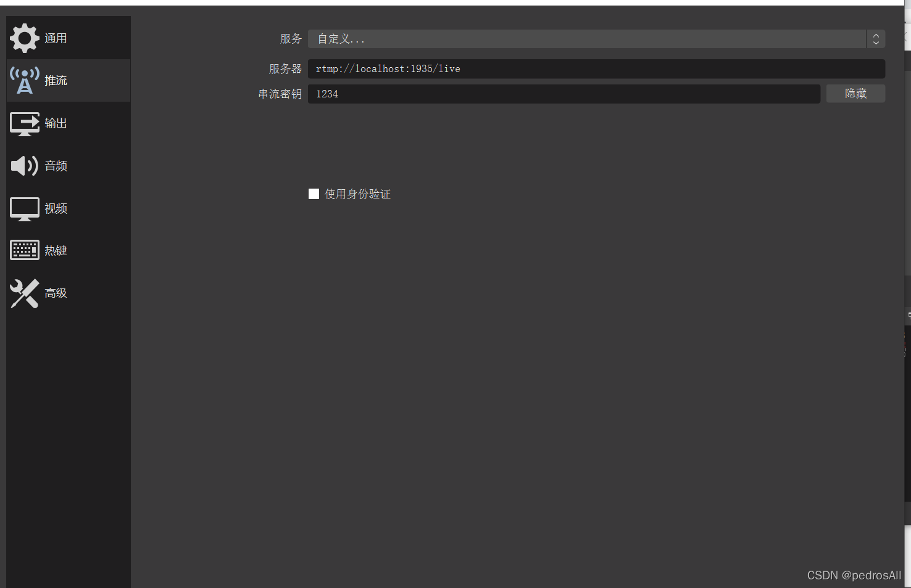
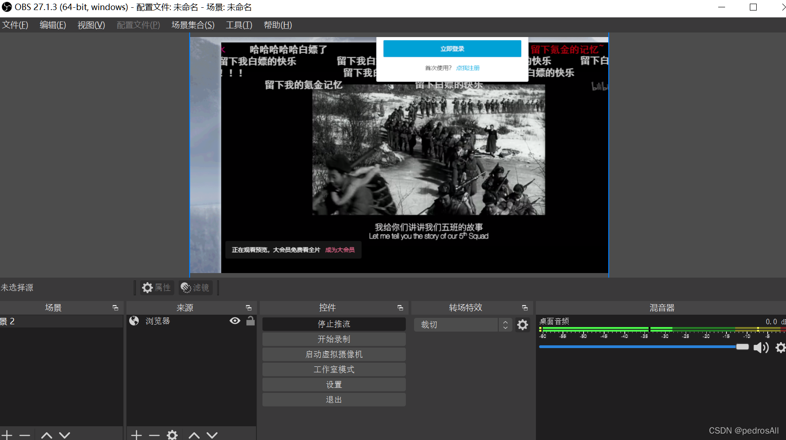
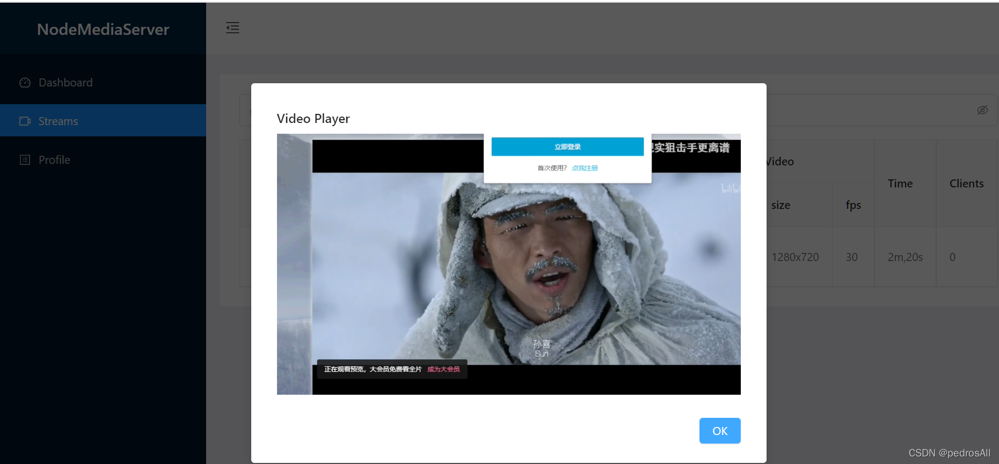

>实现直播主要是进行推流和拉流。
>
>推流: 用户发起直播时会将直播时产生的视频流推送到流媒体服务器的这个过程。
> 
>拉流: 其他客户端可以通过流媒体服务器实时的拉取直播用户端的视频流这个过程。

### 1. 下载OBS
>[OBS](https://obsproject.com/)，它是一个免费的开源的视频录制和视频实时流软件。

### 2. 引入插件nodeMediaSeaver
>Node-Media-Server 是一个 Node.js 实现的 RTMP/HTTP/WebSocket/HLS/DASH 流媒体服务器。
```bash
npm install node-media-server
```

### 3.在服务端加入以下代码
```javascript
const NodeMediaServer = require("node-media-server");
const config = {
    rtmp: {
        port: 1935,
        chunk_size: 60000,
        gop_cache: true,
        ping: 60,
        ping_timeout: 30,
    },
    http: {
        port: 8099,
        allow_origin: "*",
    },
};
var nms = new NodeMediaServer(config);
nms.run();
```
>这里需要注意的是有两个端口号，一个是推流地址的端口号1935，还有一个是拉流地址的端口号8099。当然这个端口号可以自己设置。
>此时需要将服务端启动。

### 4.打开OBS进行推流
>点击文件-设置-推流，设置推流地址。
>此时这里填写的地址就是你的推流地址。
>设置完成后，点击开始推流。
>

### 5.查看推流界面
>在浏览器输入:http://localhost:8099/admin/。点击streams查看推流视频。如果你想在html界面播放。此时的播放地址为rtmp://localhost:8099/live/1234.flv。因为是flv.js格式，所以需要video标签进行播放。


