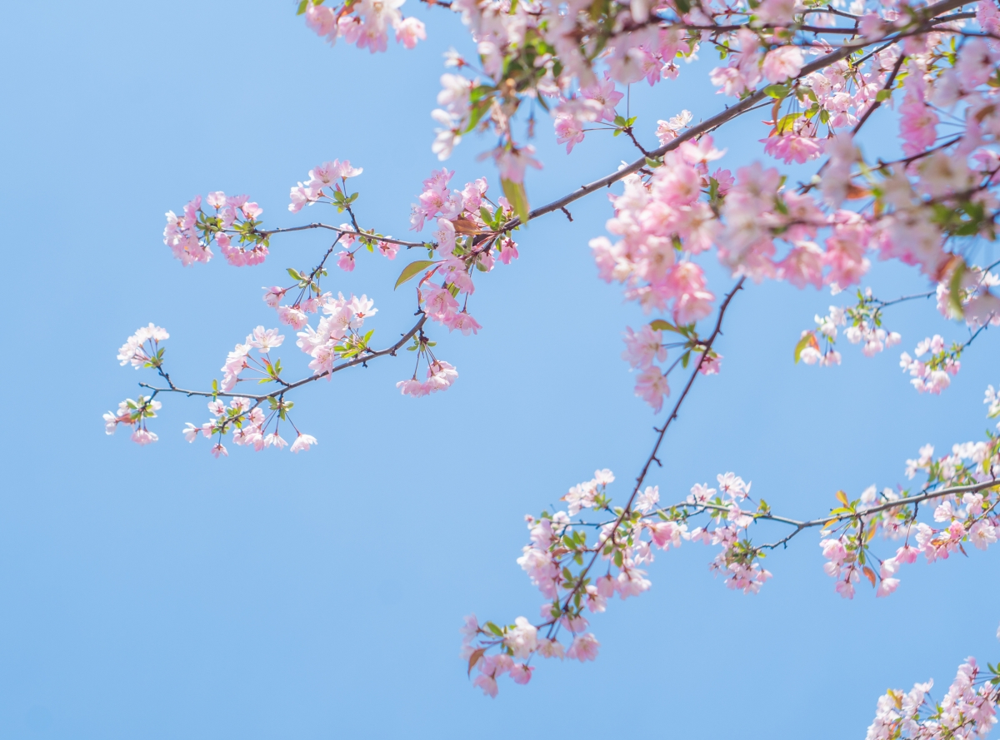

#  4月26日 瞎逛博客有感

## Info

| Date     | Weather        | Mood |
|----------|----------------|------|
| 周一 10:36 | 重庆 5°C ~9°C  | none |

## Daily

> *仓秉实而知礼节,衣食足而知荣辱。*

## Notes

先总结最近吧，年过完了已经上了一周班的我。还是按部就班的上着班，下班、周末躺着玩手机、玩游戏、刷漫画。
计划着完善博客、软考唉。目前都还没有行动。

最近比较空闲，上午逛了一下掘金、积薪、还有几个个人博客。看到有一篇博主他写的、从一无所有到现在的第二套房。
不是羡慕，是印照。他非科班出身、一开始是中专学历进厂流水线那种，后来因为他和他现在的妻子因意外怀孕导致结婚生子。
因为家庭的压力，迫使他不断的努力，当然也少不了他的母亲以及他贵人的帮助。到现在稳定的工作(体制内)。看完确实有种轻舟已过万重山，但他现在处于30而立这个阶段还是得继续努力唉。

他因为家庭的压力，接外包、做项目。从开始培训时候的5K到现在16K。说实话给我的启发还蛮深刻的。想到自己，现阶段会不会太轻松了？
现阶段好像温水煮青蛙，稳定的工作（收入不怎么样）。也无其他的压力。就像没压力就没动力。好像什么都不需要迫使着我去前行。

我也在思考，或许不应该继续这样下去了？

