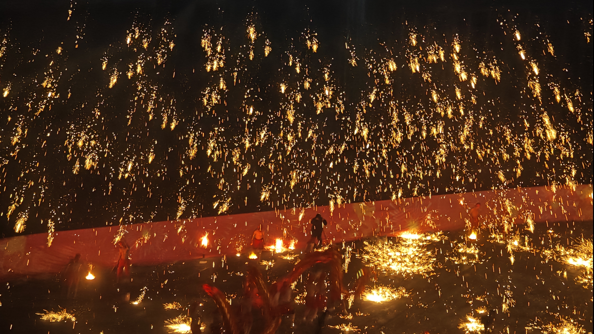

import Lake1 from '@site/docs/log/2024-2/log_img/1.jpg'
import Lake2 from '@site/docs/log/2024-2/log_img/2.jpg'
import Lake3 from '@site/docs/log/2024-2/log_img/3.jpg'
import BaseImgList from '@site/src/components/BaseImgList'
export const LakeList = [Lake1,Lake2,Lake3]

#  2月1日 打铁花~

>打铁花，是流传于豫晋地区的民间传统烟火，国家级非物质文化遗产之一。

## Info

| Date     | Weather        | Mood |
|----------|----------------|------|
| 周六 21:56 | 重庆 2°C ~6°C  ☀ | none |

## Daily

> *人间何所以，观风与月舒。*

## Notes

   感觉好久没写了，一个多月了。还是在该玩玩，该上班上班。今天去重庆大悦城看打铁花了，好看，很nice。也不枉我等到那在冷风中等待了1个多小时。以下是打铁花图片视频，哈哈哈哈。
   <BaseImgList imgList={LakeList} />

最近有点焦虑，原因呢：目前的工资还是太低了！！！准确的说到手6800左右，但是感觉太少了。

不够买房啊！这样下去没有尽头。害，为什么会产生这样的想法呢。这样的想法是，当我看到我朋友因为他女朋友认为他工资（5k左右）低不够以后的生活，结婚—买房—甚至生孩子（这个是我的延续）而分手。当我看到我妈看到我的工资短信而陷入沉默，在这之前她说了我们的亲戚今年挣了15几万，20几万。
有个舅舅挣了50几万。当我想到以我现在的工资还不够以后的成家........说实话真的。当然引发这一系列的思考是因为，之前入职我们公司的一位同事离职了，也是因为工资的原因吧。她之前是北京滴滴的，薪资是21K*16。让我感到了不平衡，但回想起自己的学历还是陷入了自卑，感觉简历都过不了。凭什么去争。

所以现在制作计划，过软考，改简历，找工作（虽然或许还得苟一段时间）。

别想其他的了，准备再上几天班回家过年啦！哈哈哈哈哈~~~~

